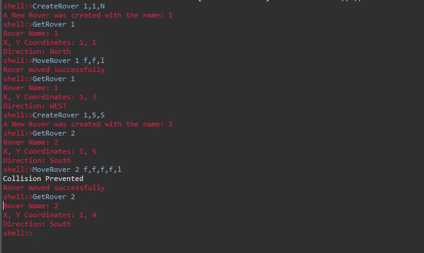

## A Mars Rover CLI Application
#### About
This is a simple command line interface application built using Spring Boot and Spring Shell.
In this application, we are controlling a "Mars Rover" using our CLI. You can create multiple rovers, you can give them commands to move forwards, backwards, and turn left or right. Then, you can use a command to get their current position and bearing. 

You can also create and control multiple rovers. Furthermore, when a rover you are controlling is about to collide with another rover, it will stop, and cancel all subsequent commands.

Here is the lists of commands you have available to you:

1. CreateRover Command. CreateRover <x coordinate>,<y coordinate>,<direction of rover>.
This command will create and return the name of the rover.

2. GetRover Command. GetRover <Rover Name>. This will print the coordinates and direction the rover is facing.

3. MoveRover Command. MoveRover <Rover Name> <Movement Instructions in the form "f,f,r,l,b">. This will parse the movement instructions and move the rover as instructed. If it detects an incoming collision with another rover, it will stop moving and cancel subsequent commands.

These are the movement commands available:

f – Move forward 1 coordinate in the current direction

b – Move backward 1 coordinate in the current direction

r – Rotate 90 degree clock-wise from current direction

l – Rotate 90 degree anti clock-wise from current direction

Here is a screenshot of the application in action:

First, we use the CreateRover Command to create a rover at position (1, 1) facing North. Then, we use the GetRover Command to confirm the position of the rover. Next, we use the MoveRover Command to tell Rover 1 to move forward twice, then turn left. Then we use the GetRover Command to confirm what happened. Next, we create a new rover with position (1, 5) facing West. Then, we ask the rover to move forward 4 times, then turn left, knowing that Rover 1 is in the way. A collision was prevented, the system prints out the event, and subsequent move commands are ignored.